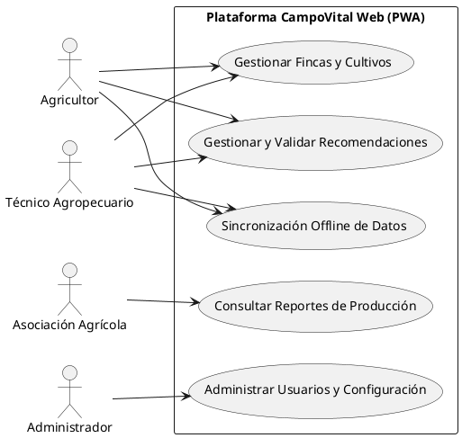
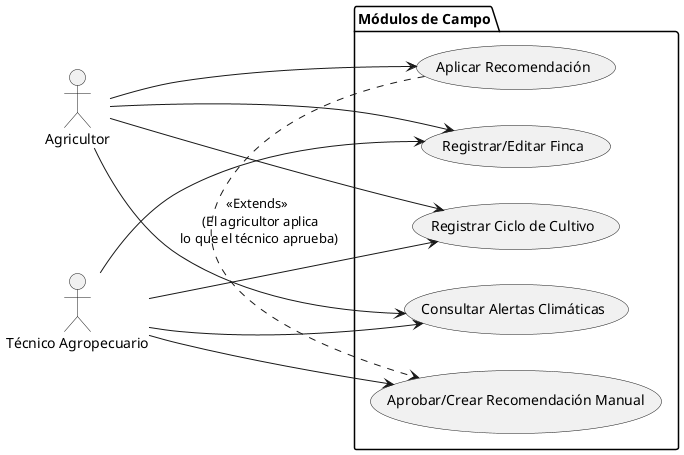
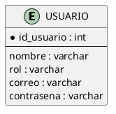
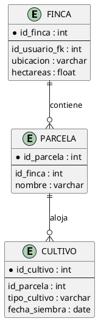
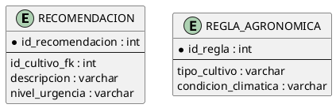
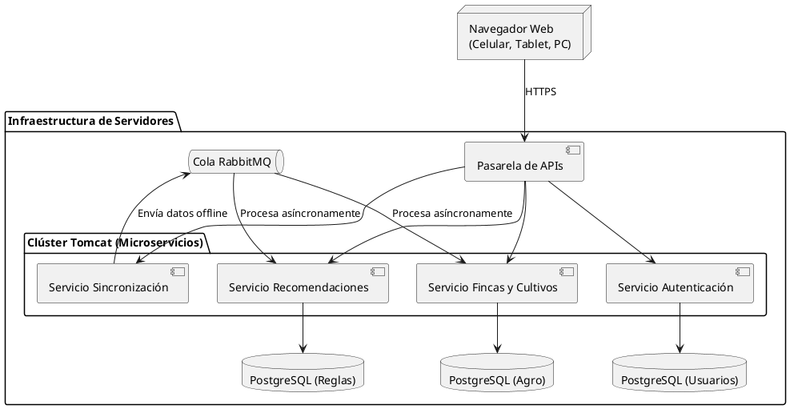
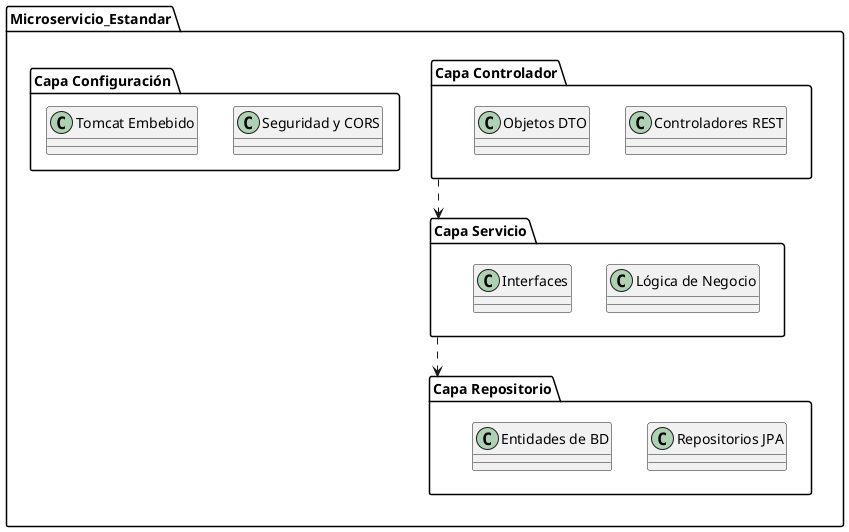
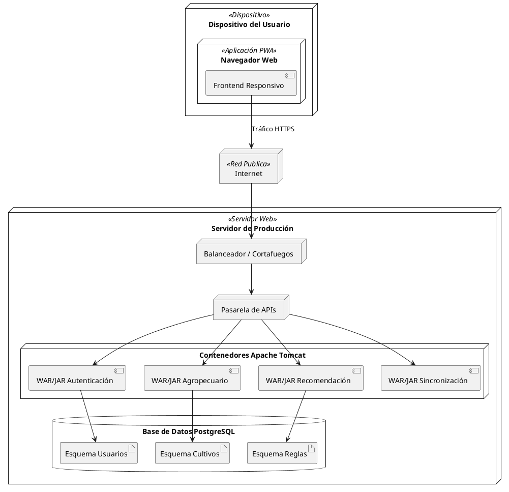

# Identidad del Proyecto
* **Nombre:** CampoVital
* **Eslogan:** "Tecnología que echa raíces" / "Conectando el campo con el futuro"

---

# Documento Consolidado: Arquitectura, Casos de Uso y Requerimientos
---

## 1. Resumen: Microservicios y Bases de Datos Necesarias
Para este proyecto bajo una arquitectura de microservicios, serán necesarios **4 Microservicios principales** y, aplicando el patrón de diseño, se requerirán **4 Bases de Datos lógicas** (esquemas independientes dentro de un servidor PostgreSQL).

1. **Microservicio de Autenticación y Usuarios:** 
   * **¿Para qué sirve?** Gestiona el inicio de sesión, contraseñas, roles (Admin, Técnico, etc.) y recuperación de cuentas.
   * **Base de datos:** `db_usuarios` (PostgreSQL).
2. **Microservicio Agrícola (Fincas y Cultivos):**
   * **¿Para qué sirve?** Es el núcleo (Core) donde el agricultor y técnico registran las fincas, hectáreas, parcelas y siembras.
   * **Base de datos:** `db_agro` (PostgreSQL).
3. **Microservicio de Recomendaciones y Clima:**
   * **¿Para qué sirve?** Consume las APIs externas del clima, evalúa las reglas agronómicas y genera sugerencias automáticas o manuales.
   * **Base de datos:** `db_recomendaciones` (PostgreSQL).
4. **Microservicio de Sincronización Offline:**
   * **¿Para qué sirve?** Recibe todos los paquetes de datos cuando un celular recupera la señal de internet, los guarda en una cola (RabbitMQ) y los distribuye a los otros servicios para no saturarlos.
   * **Base de datos:** No usa base de datos propia persistente, usa un broker de mensajería (RabbitMQ).

*(Nota: También puede existir un microservicio ligero de "Reportes" para la Asociación Agrícola que consuma datos de lectura).*

---

## 2. Requerimientos Funcionales Corregidos y Detallados

*   **UC0: Autenticación de Usuarios (Nuevo)**
    *   **RF-00:** El sistema debe proporcionar un mecanismo de autenticación centralizado que permita a todos los usuarios registrados (Agricultores, Técnicos, Asociación y Administradores) iniciar sesión en la plataforma de manera segura mediante la validación estricta de sus credenciales de acceso (correo electrónico y contraseña cifrada), garantizando así que solo personal autorizado pueda acceder a las funcionalidades correspondientes a su rol a través de su dispositivo.

*   **UC6: Gestionar Usuarios (Corregido)**
    *   **RF-25:** El sistema debe habilitar un módulo administrativo integral que le permita al perfil de Administrador crear, editar y gestionar de forma centralizada las cuentas de acceso para todos los actores de la plataforma, permitiendo la asignación obligatoria de roles específicos (Agricultores, Técnicos Agropecuarios y Asociación Agrícola) para establecer un control de acceso adecuado.

*   **UC10: Sincronizar Información (Corregido)**
    *   **RF-40.1:** El sistema debe incorporar un almacenamiento local en el navegador que permita al Agricultor guardar temporalmente y de forma segura todos los registros detallados de sus fincas, parcelas y ciclos de cultivos directamente en la memoria de su dispositivo, garantizando que el flujo de trabajo no se interrumpa en caso de pérdida de conectividad a internet.
    *   **RF-40.2:** El sistema debe proporcionar al Técnico Agropecuario la capacidad de persistir localmente en su dispositivo todas las evaluaciones técnicas y recomendaciones agronómicas que genere durante sus visitas de campo, asegurando que la información recolectada en zonas sin cobertura de red se mantenga íntegra.
    *   **RF-40.3:** El sistema debe implementar un servicio en segundo plano que monitoree el estado de la red del dispositivo, de manera que, al detectar una conexión estable, inicie automáticamente la transmisión de todos los datos almacenados localmente hacia el Microservicio de Sincronización en la nube.

*   **UC3: Validar Recomendaciones Técnicas (Restaurado)**
    *   **RF-12:** El sistema debe permitir al Técnico Agropecuario visualizar y auditar las sugerencias de manejo generadas automáticamente por el motor de reglas del sistema, otorgándole la autoridad técnica para aprobar, modificar o rechazar su publicación hacia el perfil del Agricultor.

*   **Nuevos Requerimientos de Backend (Añadir al final de tu documento, ej. RF-43 a RF-45)**
    *   **RF-43:** El sistema debe ejecutar una tarea programada (cron job) cada 12 horas que se encargue de establecer comunicación con las APIs meteorológicas externas para extraer y procesar variables climáticas críticas (humedad, precipitación y temperatura) según las coordenadas geográficas de cada finca.
    *   **RF-44:** El sistema debe ejecutar un motor de reglas que tome los datos climáticos obtenidos y los compare detalladamente con las constantes térmicas y requerimientos hídricos específicos que exige la etapa fenológica actual de cada cultivo (ej. germinación, floración) para detectar posibles anomalías.
    *   **RF-45:** El sistema debe generar y enviar notificaciones de pre-alerta técnica a la bandeja del Técnico Agropecuario advirtiendo cuando las variables climáticas proyectadas superen los umbrales de tolerancia del cultivo, permitiéndole validar sugerencias preventivas antes de publicarlas.

---

## 3. Diagramas de Casos de Uso (PlantUML)

*(Instrucción: Copia el código a https://www.planttext.com/ para generar las imágenes de Casos de Uso y pegarlas en el Word)*

**Caso de Uso Nivel 0 (Visión General de Actores y Módulos)**

**Caso de Uso Nivel 1 (Detalle de Flujo Agrícola y Recomendaciones)**

---

## 4. Diseño Arquitectónico (Microservicios)

*(Mantener el texto generado anteriormente en el documento Word sobre la justificación de microservicios, aislamiento de fallos, servidores Tomcat externos y la naturaleza de Aplicación Web Responsiva).*

---

## 5. Diagramas de Arquitectura (PlantUML)

**Diagramas de Datos (Una Base de Datos por Microservicio)**

*Base de Datos: Autenticación*

*Base de Datos: Agrícola*

*Base de Datos: Recomendaciones*

**Diagrama de Bloques**

**Diagrama de Paquetes**

**Diagrama de Despliegue**

