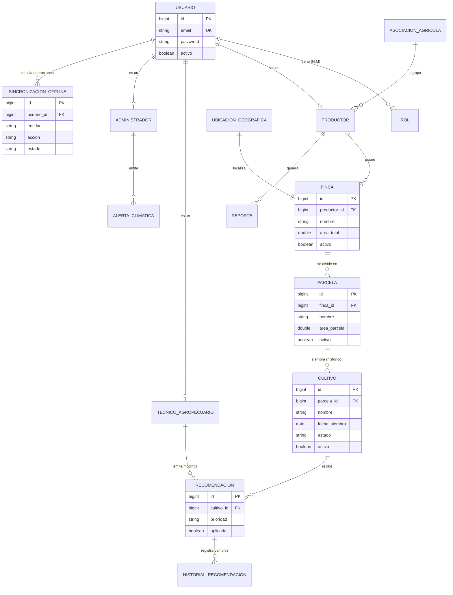

# Modelo Entidad-Relación (MER) — AgroSmart Magdalena

Este documento formaliza el modelo de dominio diseñado y construido para satisfacer estrictamente los requerimientos académicos, reglas de negocio agrícolas y las restricciones de conectividad intermitente en el Magdalena.

---

## 1. Diagrama Lógico (Entidad-Relación)

A continuación, el diagrama oficial `Mermaid` mostrando la integridad referencial y las dependencias estructurales:

---

## 2. Decisiones y Ajustes de Modelado

### Estructura Jerárquica: Finca ➔ Lote ➔ Cultivo
En lugar de relacionar un "cultivo" directamente a un productor, el modelo respeta la realidad física del predio:
1. **Finca**: Unidad productiva mayor. Contiene el área total y ubicación (`UbicacionGeografica` con vereda y municipio para cruce con alertas climáticas).
2. **Lote/Parcela**: Subdivisiones de la finca con su propia área y tipo de suelo. La validación en el servicio verifica que la suma de lotes no exceda el área de la finca.
3. **Cultivo**: Instancia de siembra temporal en un lote. Tiene fechas de inicio/fin y estado (PLANIFICADO ➔ SEMBRADO ➔ COSECHADO). Permite registrar históricamente qué se sembró en cada lote a lo largo de los años.

### Conectividad Intermitente (Sincronización Offline)
Diseñamos la tabla `sincronizaciones_offline` para soportar dispositivos móviles de gama baja sin internet:
- **`entidad`, `accion` y `datos_json`**: Captura operaciones estructurales completas (ej. crear un cultivo) como un comando diferido.
- **`estado`** (PENDIENTE, EN_PROCESO, SINCRONIZADO, ERROR): Permite un flujo robusto. Cuando el celular recupere señal de internet, el PWA enviará el lote de peticiones pendientes, y el backend ejecutará el volcado ordenado hacia la BD real.

### Estrategia de Soft Delete (Borrado Lógico)
- Entidades críticas paramétricas como `Usuario`, `Finca`, `Parcela`, `Cultivo` y `AlertaClimatica` solo son **desactivadas** (`activo = false`) para evitar romper la integridad referencial y permitir reportes históricos auditivos.
- Tablas transaccionales puras (ej. `HistorialRecomendacion` o `SincronizacionOffline`) son inmutables/fijas. No se borran.

### Integridad Referencial e Índices (Actualizaciones Académicas)
Se agregan y documentan índices explícitos requeridos para producción:
- **Claves foráneas indexadas**: `productor_id` (en Fincas), `finca_id` (en Parcelas), `parcela_id` (en Cultivos).
- **Índices de búsqueda por defecto**: `estado` y `municipio`.

### Auditoría Completa
Toda tabla central hereda de una clase `BaseEntity`, la cual utiliza los pre-listeners de JPA (`@MappedSuperclass`, `@EntityListeners`) para llenar automáticamente `created_at` y `updated_at`, previniendo modificaciones manuales y garantizando cumplimiento auditable.
