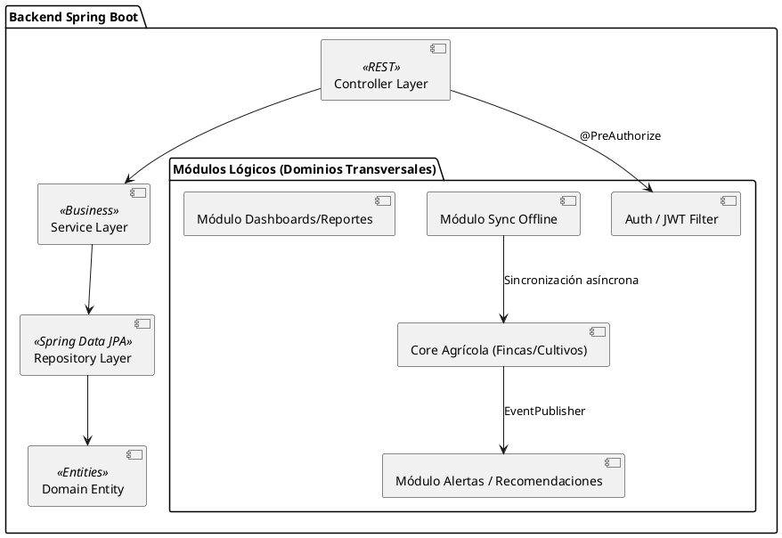
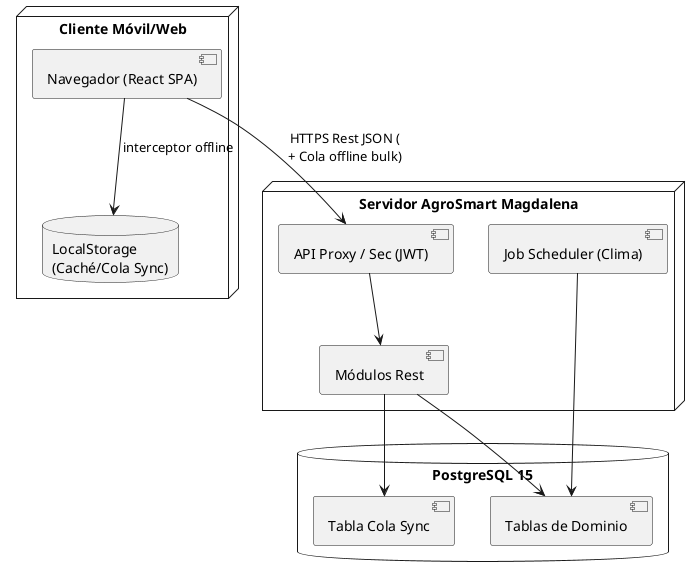

# Arquitectura, Decisiones y Trazabilidad (Entregable 3)

Este documento avala el estado actual del proyecto AgroSmart, documentando las decisiones tomadas que moldean el código. No es teórico, es un reflejo 1 a 1 de la base de código.

## 1. Decisiones Arquitectónicas (ADRs)

### ADR 1: Evolución de Monolito a Microservicios
*   **Decisión**: Arquitectura de Microservicios orquestada mediante un API Gateway.
*   **Justificación de la Refactorización**: Aunque el proyecto inició conceptualmente como un monolito para agilizar el MVP, la arquitectura evolucionó a Microservicios para aislar fallos y escalar de forma independiente. Se dividió el sistema en un `API Gateway` (único punto de entrada en el puerto 9000), un `Auth Service` (puerto 8081, con su propia BD para la seguridad estricta de usuarios) y un `Agro Service` (puerto 8082, enfocado exclusivamente en la carga transaccional agrícola).
*   **Rastro en código**: El proyecto backend es ahora un ecosistema Multi-módulo de Maven con un `pom.xml` padre, segmentado físicamente en las carpetas `api-gateway`, `auth-service` y `agro-service`, cada uno con configuración autónoma y conexión a bases de datos lógicas aisladas (`db_usuarios` y `db_agro`).

### ADR 2: Modo Offline-First (Offline-Async) por Encolamiento
*   **Decisión**: Estrategia de sincronización local diferida mediante LocalStorage en Frontend y tabla transaccional temporal en Backend (`SincronizacionOffline`).
*   **Justificación**: En zonas bananeras/cacaoteras del Magdalena el 4G es intermitente. En vez de WebSockets (que exigen conexión), se definió que el Frontend intercepte requests fallidos o forzados sin conexión y los encole enviándolos como un `lote` procesado en batch por el servidor (`SincronizacionOfflineService.procesarPendientes`). Estrategia "Server Wins" en colisiones.
*   **Rastro en código**: `axiosConfig.js` / `offlineService.js` (Frontend). `SincronizacionOfflineService` con el pool transaccional de operaciones.

---

## 2. Diagramas PlantUML Estructurales

### Diagrama de Paquetes / Módulos (Backend)

### Diagrama de Despliegue General

---

## 3. Matriz de Trazabilidad: Requisitos -> Ficheros de Código

| Requerimiento Funcional | Módulos y Entidades Reales en Código | Controlador y Endpoint | Frontend Sustento |
| :--- | :--- | :--- | :--- |
| **Gestionar Productores Varios** | Entidad: `Productor`, `Usuario`. Seguridad via JWT roles | `AuthController` `/auth/register` | `RegisterPage.jsx` |
| **Registrar Fincas y Parcelas** | Entidades: `Finca`, `Parcela`, `UbicacionGeografica`. Lógica `FincaService` (áreas, etc) | `FincaController` `/api/fincas` | `FincaFormPage.jsx` y `FincasPage.jsx` |
| **Registrar Ciclo de Cultivo** | Entidad `Cultivo`. Valida fechas de siembra y tamaño sobre Lote padre en `CultivoService` | `CultivoController` `/api/cultivos` | `CultivoFormPage.jsx` |
| **Operación Offline e intermitente** | Entidad: `SincronizacionOffline`. Manejado por JS interceptor y Job server | `SincronizacionOfflineController` `/api/sync/lote` | `axiosConfig.js`, `SyncPage.jsx` |
| **Dashboards Resumen y Exportación CSV** | Dinámico por roles. `DashboardService` / `ReporteService` | `DashboardController` `/api/dashboard/*` `ReporteController` `/api/reportes/*` | `DashboardPage.jsx`, `ReportesPage.jsx` |
| **Generación Recomendaciones (Alertas)** | Event Listening: `@EventListener` sobre `CultivoStateChangedEvent` hacia `RecomendacionEngineService` | `RecomendacionController` / `AlertaClimaticaController` | `RecomendacionesPage.jsx` |

## 4. Evidencia de Seguridad Implementada

La capa de seguridad del proyecto se encuentra sustentada en el archivo `SecurityConfig.java` implementando autenticación Stateless vía Spring Security. 
*   Todas las rutas están cerradas y resguardadas bajo interceptor JWT (`JwtAuthenticationFilter.java`), a excepción de los módulos configurados públicamente: `.requestMatchers("/auth/**").permitAll()`.
*   Control estricto con el decorador `@PreAuthorize("hasRole('ADMIN')")` visible en endpoints administrativos de controladores como el `DashboardController`.
*   En el Frontend (`App.jsx` y `ProtectedRoute.jsx`), se cuenta con *routing protection* para bloquear páginas a usuarios no firmados, o inyectar lógicas de lectura solo hacia aquellos con rol válido mediante `useAuth()`.
